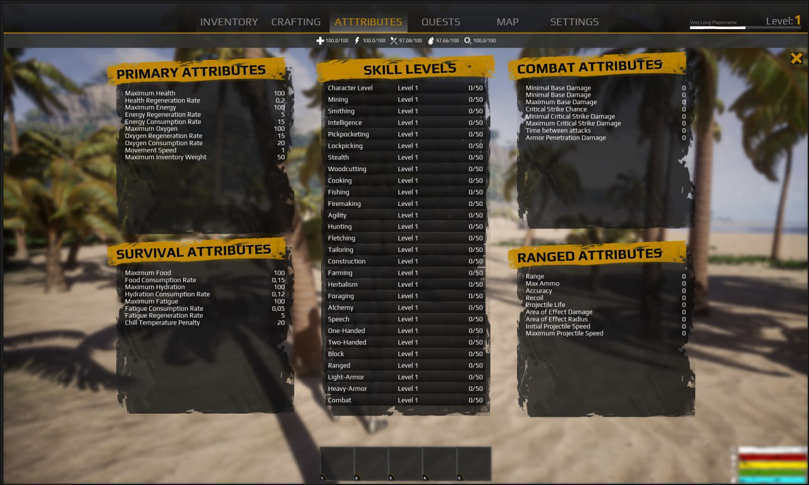

# Survival Essentials

In the unforgiving world of PrimusZ, mastering the "Survival Essentials" is not just a part of the game; it's the thin line between life and death. Amidst a landscape scarred by apocalypse, your resilience is tested by relentless threats. Here, managing your Health, Hunger, Thirst, Energy, and Oxygen isn't just strategy; it's your lifeline. Every decision, from foraging for food to crafting shelter, shapes your destiny. Welcome to a realm where survival is an art, and your every action weaves the tapestry of your journey.

<figure><figcaption></figcaption></figure>

**Health**&#x20;

Your health decreases when attacked by zombies, animals, or other players. Restore it using health items or food. Bandages are crucial for treating injuries. Increase your maximum health by leveling up your Character NFT.

**Hunger**&#x20;

Neglecting hunger reduces your energy and eventually your health. Consuming food is essential to stop starvation and maintain your energy levels for survival activities.

**Thirst**

Staying hydrated is vital. Thirst lowers your energy and health over time. Drink clean water regularly to avoid dehydration.

**Energy**

Energy is expended during sprinting and combat. Manage your energy wisely to maintain the ability to escape danger and defend yourself.

**Oxygen**

Oxygen is critical for diving activities. Monitor your oxygen levels closely to avoid drowning during underwater exploration.

Maintain these essentials by engaging in activities like fishing, hunting, and farming. Leveling up in the game allows you to enhance these attributes, storing improvements on your Character NFT, which enriches the gameplay and survival strategy in PrimusZ.
