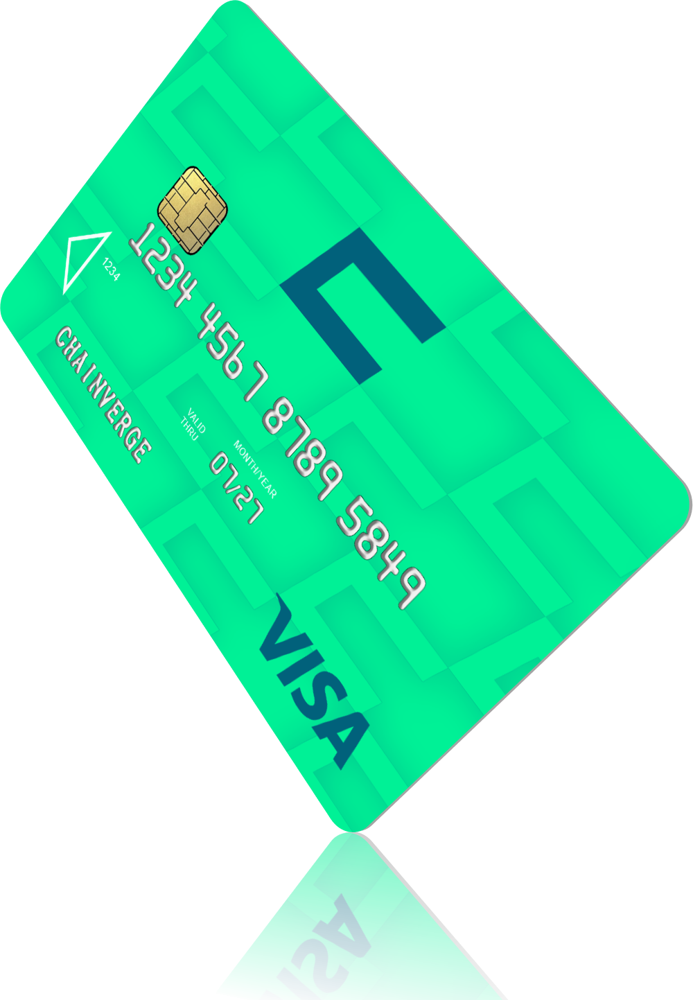
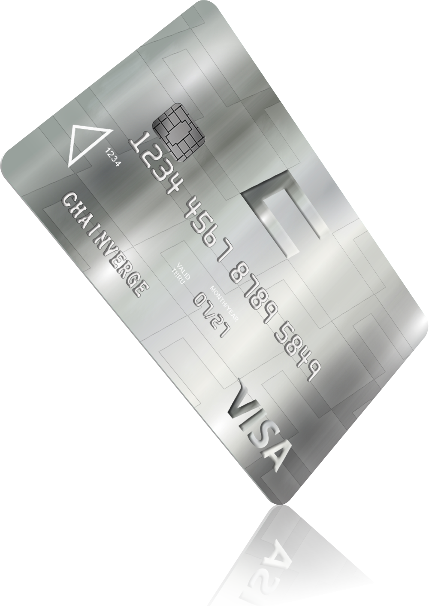

# - Crypto Card

Step into the next generation of financial freedom with our groundbreaking WEB3 Crypto Card!\
\
Seamlessly top up your card directly using **Wallet Connect**, bridging the gap between your digital assets and everyday transactions. \
We offer two distinct card versions: the "**Smaragd**" and the coveted "**Diamond**" Card. \
\
The privilege of holding the **Diamond** Card is reserved for the truly dedicated. Every month, through a transparent DAO-driven voting process, only two individuals are chosen to bear these cards. Will you be among the elite?

Preorder Now: [www.chainverge.net/cryptocard](https://www.chainverge.net/cryptocard)

***

###

<figure><figcaption></figcaption></figure>

### Smaragd Card

Material: Plastic\
Cashback: 2% ( Based on purchase Amount )\
Monthly Limit: 15.000€\
Daily Limit: 10.000€\
Daily ATM Withdraw Limit: 3000€

<figure><figcaption></figcaption></figure>

### Diamond Card

Material: Metal\
Cashback: XXX ( Based on purchase Amount )\
Monthly Limit: XXX\
Daily Limit: XXX\
Daily ATM Withdraw Limit: XXX\
Limits and Cashback are based on each cardholders engagement with the Project and its DAO.

***

**Features:**

* **Direct Top-Up:** No more hassles. Directly top up your WEB3 Card using popular wallets like MetaMask and TrustWallet.
* **Enhanced Security:** Chainverge's WEB3 Card employs state-of-the-art encryption and security protocols, ensuring your assets are always protected.
* **Real-Time Tracking:** With the Chainverge mobile app, monitor your spending, manage your card, and stay updated in real-time.

***

**Benefits:**

* **Simplicity:** The WEB3 Card offers a user-friendly interface, making crypto transactions as simple as traditional banking.
* **Flexibility:** Whether you're buying a coffee or booking a flight, the WEB3 Card is your perfect companion for both online and offline transactions.
* **Community-Centric:** As with all Chainverge products, the WEB3 Card is deeply integrated with our community-driven approach. \
  Enjoy exclusive offers, promotions, and rewards curated just for our community.

***

**Securing the Diamond Card:**

The journey to the Obsidian Card is more than just a transaction; it's a testament to your commitment to the crypto community. Here's your roadmap:

1. **Engage on Social Channels:** Be a beacon of knowledge and assistance. Your active participation and help in our community channels can set you apart.
2. **Invite and Enlighten:** Bring your friends into the fold. The more you introduce to our ecosystem, the closer you get to the Diamond Card.
3. **Embark on Website Missions:** Dive deep into our platform, complete tasks, and showcase your allegiance to our mission.
4. **Token Commitment:** Show your unwavering faith by freezing 25,000 tokens for a 6-month span. This not only amplifies your chances but also cements your trust in our vision.\
   After the timeline your tokens will get automatically released by the contract.
